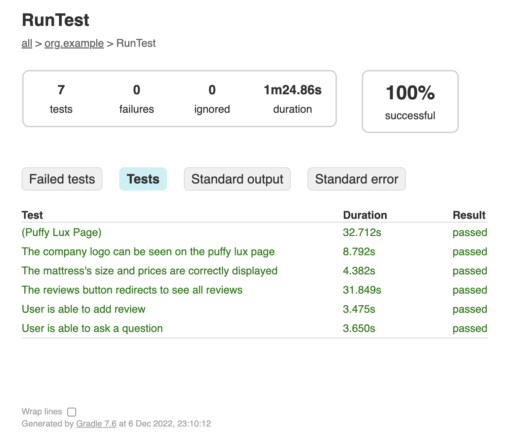

# puffy-task

### Implementation

Cucumber + JUnit 5 were chosen to write the test scenarios as it defines the tests 
in a more natural language, thus making it easily understandable, even for 
non-technical people. Additionally, this combination acts as a test management 
tool, i.e. not all scenarios need to be explicitly implemented, they can be just defined.

### Requirements

Following needs to be present before running the tests:
* JDK (tested with OpenJDK 19).
* Google Chrome (tested with version 107.0.5304.110).

To execute the automated test scenarios, run the following:

```sh
./gradlew clean test
```

After the execution is complete, open the generated report:

```sh
open build/reports/tests/test/index.html
```

